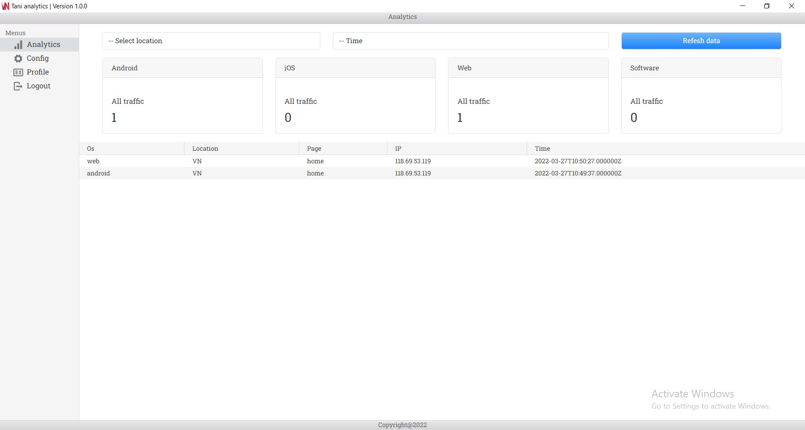

# Tani Analytics

This is feature tracking when you use Vn Native 3. We use this plugin for App, Web or Software to understand about your business. We have a software to view data and manage feature by account Tani Analytics.

## How to install ? 

    npm i vnnative3-tanianalytics

## How to import ? 

    import Vnnative3TaniAnalyticsBase from "vnnative3-tanianalytics/dist/index"

## How to use ?

    (new Vnnative3TaniAnalyticsBase).setAppToken(your_app_token).subscribe("Home",(success : {
        code:number,
        message:string
    }) => {
        console.log("Please check data in the TaniAnalytics Software");
    },(error : {
        code:number,
        message:string
    }) => {
        console.log(error);
    })

## How to get App Token ?

Currently it's beta version.

First step you need download software `version 1.0.0`

    `https://drive.google.com/drive/folders/1MsOjJT7c75lSq4zRn8P3iJzVKnpk1AOd?usp=sharing`

Next step register new account. After go to `config` to get it.    